```mermaid
flowchart TD
    START([🌙 START\nGood evening. Let's look at your day.])
    START --> A1_OPEN

    A1_OPEN[/A1_OPEN — Question\nIf today were a weather report, what would it be?\nSunny | Overcast | Stormy | Foggy/]
    A1_OPEN --> A1_D1

    A1_D1{A1_D1 — Decision\nSunny/Overcast\nvs Stormy/Foggy}
    A1_D1 -->|Sunny or Overcast| A1_Q_AGENCY_HIGH
    A1_D1 -->|Stormy or Foggy| A1_Q_AGENCY_LOW

    A1_Q_AGENCY_HIGH[/A1_Q_AGENCY_HIGH — Question\nWhen something went well, what made it happen?\nPrepared | Team | Lucky | Adapted/]
    A1_Q_AGENCY_LOW[/A1_Q_AGENCY_LOW — Question\nWhen things got hard, what was your first instinct?\nControl | Wait | Stuck | Push/]

    A1_Q_AGENCY_HIGH --> A1_D2
    A1_Q_AGENCY_LOW --> A1_D2

    A1_D2{A1_D2 — Decision\nInternal vs External\nSignal}
    A1_D2 -->|prepared/adapted/control/push| A1_Q2_INTERNAL
    A1_D2 -->|luck/team/wait/stuck| A1_Q2_EXTERNAL

    A1_Q2_INTERNAL[/A1_Q2_INTERNAL — Question\nWhere do you put the cause of what went wrong?\nMostly me | Split | Mostly circumstances\n✦ signal: axis1:internal/]
    A1_Q2_EXTERNAL[/A1_Q2_EXTERNAL — Question\nCan you name the smallest choice you made?\nStayed calm | Asked for help | Kept going | Not sure\n✦ signal: axis1:external/]

    A1_Q2_INTERNAL --> A1_D3
    A1_Q2_EXTERNAL --> A1_D3

    A1_D3{A1_D3 — Decision\nRoute to Reflection\nby Axis 1 signal}
    A1_D3 -->|axis1:internal| A1_R_INTERNAL
    A1_D3 -->|axis1:external| A1_R_EXTERNAL

    A1_R_INTERNAL[A1_R_INTERNAL — Reflection\nYou see your hand in what happened today.\nThat's agency.]
    A1_R_EXTERNAL[A1_R_EXTERNAL — Reflection\nEven on tough days, there's a decision\nthat was yours. That's where your agency lives.]

    A1_R_INTERNAL --> BRIDGE_1_2
    A1_R_EXTERNAL --> BRIDGE_1_2

    BRIDGE_1_2>BRIDGE_1_2 — Bridge\nNow let's shift from HOW you handled things\nto WHAT you gave.]
    BRIDGE_1_2 --> A2_OPEN

    %% AXIS 2
    A2_OPEN[/A2_OPEN — Question\nThink about one meaningful interaction today.\nGave | Received | Transactional | None/]
    A2_OPEN --> A2_D1

    A2_D1{A2_D1 — Decision\nGave vs Received/Other}
    A2_D1 -->|gave| A2_Q_CONTRIBUTION
    A2_D1 -->|received/transactional/none| A2_Q_ENTITLEMENT

    A2_Q_CONTRIBUTION[/A2_Q_CONTRIBUTION — Question\nWhat was the nature of that giving?\nBeyond role | Taught | Unglamorous | Listened\n✦ signal: axis2:contribution/]
    A2_Q_ENTITLEMENT[/A2_Q_ENTITLEMENT — Question\nWhat sounds most familiar today?\nUnnoticed | Others slack | Focused self | Surviving\n✦ signal: axis2:entitlement/]

    A2_Q_CONTRIBUTION --> A2_Q2
    A2_Q_ENTITLEMENT --> A2_Q2

    A2_Q2[/A2_Q2 — Question\nWas there a moment you went beyond what was asked?\nYes extra | Thought not done | Expected only | Intentional no/]
    A2_Q2 --> A2_D2

    A2_D2{A2_D2 — Decision\nRoute by Axis 2 signal}
    A2_D2 -->|axis2:contribution| A2_R_CONTRIBUTION
    A2_D2 -->|axis2:entitlement| A2_R_ENTITLEMENT

    A2_R_CONTRIBUTION[A2_R_CONTRIBUTION — Reflection\nYou gave today. That's the quiet engine\nof functional teams.]
    A2_R_ENTITLEMENT[A2_R_ENTITLEMENT — Reflection\nTracking what you get is natural.\nBut there's a shift available — from owed to give.]

    A2_R_CONTRIBUTION --> BRIDGE_2_3
    A2_R_ENTITLEMENT --> BRIDGE_2_3

    BRIDGE_2_3>BRIDGE_2_3 — Bridge\nNow let's zoom out from WHAT you gave\nto WHO you were thinking about.]
    BRIDGE_2_3 --> A3_OPEN

    %% AXIS 3
    A3_OPEN[/A3_OPEN — Question\nIn today's biggest challenge — who's in the frame?\nJust me | Me and one | Team | Customer/]
    A3_OPEN --> A3_D1

    A3_D1{A3_D1 — Decision\nSelf vs Other Radius}
    A3_D1 -->|just_me/me_and_one| A3_Q_SELF
    A3_D1 -->|team/customer| A3_Q_OTHER

    A3_Q_SELF[/A3_Q_SELF — Question\nWas anyone affected by your work today?\nYes specific | Probably | Isolated\n✦ signal: axis3:self/]
    A3_Q_OTHER[/A3_Q_OTHER — Question\nDid you act on that awareness today?\nActed | Aware not acted | Mission focused\n✦ signal: axis3:other/]

    A3_Q_SELF --> A3_D2
    A3_Q_OTHER --> A3_D2

    A3_D2{A3_D2 — Decision\nRoute by Axis 3 signal}
    A3_D2 -->|axis3:self| A3_R_SELF
    A3_D2 -->|axis3:other| A3_R_OTHER

    A3_R_SELF[A3_R_SELF — Reflection\nToday attention stayed close.\nTomorrow: one glance at how your work\nlands in someone else's world.]
    A3_R_OTHER[A3_R_OTHER — Reflection\nYour frame includes others.\nResearch shows this expands meaning,\nnot just empathy.]

    A3_R_SELF --> SUMMARY
    A3_R_OTHER --> SUMMARY

    SUMMARY[SUMMARY — Summary Node\nHere's what your day looked like through the tree.\nAxis 1 + Axis 2 + Axis 3 synthesis\nInterpolates answers + signals.]
    SUMMARY --> END

    END([✦ END\nRest well. See you tomorrow.])

    %% Styling
    classDef startEnd fill:#1a1a2e,stroke:#e2b96f,color:#e2b96f,rx:20
    classDef question fill:#16213e,stroke:#4a9eca,color:#c8dff0
    classDef decision fill:#0f3460,stroke:#e94560,color:#fff
    classDef reflection fill:#1a1a2e,stroke:#7ecfa0,color:#b8eecb
    classDef bridge fill:#2d1b69,stroke:#c084fc,color:#e9d5ff
    classDef summary fill:#1c1917,stroke:#e2b96f,color:#fef3c7

    class START,END startEnd
    class A1_OPEN,A1_Q_AGENCY_HIGH,A1_Q_AGENCY_LOW,A1_Q2_INTERNAL,A1_Q2_EXTERNAL,A2_OPEN,A2_Q_CONTRIBUTION,A2_Q_ENTITLEMENT,A2_Q2,A3_OPEN,A3_Q_SELF,A3_Q_OTHER question
    class A1_D1,A1_D2,A1_D3,A2_D1,A2_D2,A3_D1,A3_D2 decision
    class A1_R_INTERNAL,A1_R_EXTERNAL,A2_R_CONTRIBUTION,A2_R_ENTITLEMENT,A3_R_SELF,A3_R_OTHER reflection
    class BRIDGE_1_2,BRIDGE_2_3 bridge
    class SUMMARY summary
```

## Node Count Summary

| Type | Count | IDs |
|------|-------|-----|
| start | 1 | START |
| question | 11 | A1_OPEN, A1_Q_AGENCY_HIGH, A1_Q_AGENCY_LOW, A1_Q2_INTERNAL, A1_Q2_EXTERNAL, A2_OPEN, A2_Q_CONTRIBUTION, A2_Q_ENTITLEMENT, A2_Q2, A3_OPEN, A3_Q_SELF, A3_Q_OTHER |
| decision | 7 | A1_D1, A1_D2, A1_D3, A2_D1, A2_D2, A3_D1, A3_D2 |
| reflection | 6 | A1_R_INTERNAL, A1_R_EXTERNAL, A2_R_CONTRIBUTION, A2_R_ENTITLEMENT, A3_R_SELF, A3_R_OTHER |
| bridge | 2 | BRIDGE_1_2, BRIDGE_2_3 |
| summary | 1 | SUMMARY |
| end | 1 | END |
| **TOTAL** | **29** | |

## All Possible Paths

There are **8 unique conversation paths** through the tree (2 branches per axis × 3 axes):

1. Sunny → Prepared → Internal → Contribution → Extra → Other = *Victor + Contributor + Altrocentric*
2. Sunny → Prepared → Internal → Contribution → Extra → Self = *Victor + Contributor + Self*
3. Sunny → Team → External → Entitlement → Expected → Other = *External + Entitlement + Other*
4. Stormy → Control → Internal → Contribution → Extra → Other = *Victor + Contributor + Other*
5. Stormy → Wait → External → Entitlement → Expected → Self = *Victim + Entitlement + Self*
6. Foggy → Stuck → External → Entitlement → Expected → Self = *Victim + Entitlement + Self*
7. Overcast → Adapted → Internal → Contribution → Yes → Other = *Victor + Contributor + Altrocentric*
8. Stormy → Push → Internal → Entitlement → Surviving → Self = *Mixed Victor + Entitlement + Self*

Every path is **deterministic**: same inputs → same outputs, every time.
